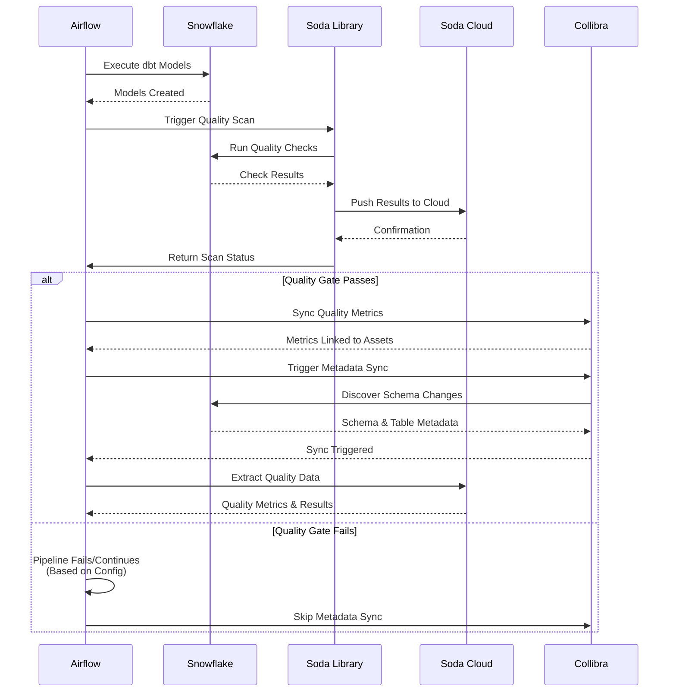

# Data Engineering, Governance, and Quality Integration Platform

A comprehensive platform demonstrating the integration of data engineering, data governance, and data quality management. This project showcases how to bridge the gap between technical data pipelines, governance frameworks, and quality monitoring to create a unified data management ecosystem.

## Project Overview

This platform demonstrates a complete integration framework that connects:

- **Data Engineering**: Automated data pipelines with transformations and orchestration
- **Data Governance**: Centralized catalog and metadata management with Collibra
- **Data Quality**: Automated quality monitoring with standardized dimensions and reporting

### Core Integration Value

**Unified Data Management**: Quality results are automatically synchronized with governance catalogs, creating a single source of truth where:
- Data quality metrics are linked to data assets (tables, columns)
- Governance metadata is enriched with quality insights
- Engineering pipelines trigger quality checks and governance updates
- All stakeholders access quality and governance information in one place

## Integration Architecture

### Three-Pillar Integration

```
Data Engineering (dbt + Airflow)
         ↓
    Data Pipeline
         ↓
Data Quality (Soda) ────→ Data Governance (Collibra)
         ↓                        ↓
    Quality Checks          Asset Mapping
         ↓                        ↓
    Quality Results ───────→ Governance Catalog
```

### Complete Data Flow

```
RAW Layer (Snowflake)
    ↓
Soda Quality Checks (RAW) [VALIDATION PHASE]
    ↓
Collibra Metadata Sync (RAW Schema) [GOVERNANCE PHASE - GATED BY QUALITY]
    ↓
dbt Transformations (STAGING) [BUILD PHASE]
    ↓
Soda Quality Checks (STAGING) [VALIDATION PHASE]
    ↓
Collibra Metadata Sync (STAGING Schema) [GOVERNANCE PHASE - GATED BY QUALITY]
    ↓
dbt Models (MARTS) [BUILD PHASE]
    ↓
Soda Quality Checks (MARTS) [VALIDATION PHASE]
    ↓
Collibra Metadata Sync (MART Schema) [GOVERNANCE PHASE - GATED BY QUALITY]
    ↓
Soda Quality Checks (QUALITY) + dbt Tests [VALIDATION PHASE]
    ↓
Collibra Metadata Sync (QUALITY Schema) [GOVERNANCE PHASE - GATED BY QUALITY]
    ↓
Cleanup Artifacts [CLEANUP PHASE]
    ↓
Soda Cloud Dashboard + Collibra Integration
    ├──→ Quality Metrics → Data Assets (Tables)
    ├──→ Check Results → Column Assets
    ├──→ Quality Dimensions → Governance Framework
    └──→ Metadata Sync → Schema & Table Updates (Only Validated Data)
```

**Orchestration Philosophy: Quality Gates Metadata Sync**

Each layer follows: **Build → Validate → Govern**
- Quality checks **gate** metadata synchronization
- Collibra only syncs data that has passed quality validation
- This ensures Collibra reflects **commitments**, not **aspirations**
- Collibra becomes a historical record of accepted states

## Architecture Diagrams

### Integration Flow: Soda → Collibra



## Architecture Principles

### Clean Architecture Layers

```
┌─────────────────────────────────────────┐
│         Presentation Layer               │
│  (Scripts, Airflow DAGs, CLI)           │
└─────────────────────────────────────────┘
                    ↓
┌─────────────────────────────────────────┐
│         Service Layer                   │
│  (Business Logic Orchestration)          │
│  - PipelineService                     │
│  - QualityService                      │
│  - MetadataService                     │
└─────────────────────────────────────────┘
                    ↓
┌─────────────────────────────────────────┐
│         Repository Layer                │
│  (Data Access Abstraction)              │
│  - SodaRepository                      │
│  - CollibraRepository                  │
└─────────────────────────────────────────┘
                    ↓
┌─────────────────────────────────────────┐
│         Core Infrastructure             │
│  (Config, Logging, Exceptions, Retry)   │
└─────────────────────────────────────────┘
```

### Design Patterns

#### Repository Pattern
- **Purpose**: Abstract data access logic
- **Benefits**: Testability, maintainability, flexibility
- **Implementation**: `BaseRepository` → `SodaRepository`, `CollibraRepository`

#### Service Layer Pattern
- **Purpose**: Orchestrate business logic
- **Benefits**: Separation of concerns, reusability
- **Implementation**: `PipelineService`, `QualityService`, `MetadataService`

#### Factory Pattern
- **Purpose**: Centralized object creation with dependency injection
- **Benefits**: Loose coupling, testability
- **Implementation**: `ClientFactory`, `ServiceFactory`

#### Singleton Pattern
- **Purpose**: Single configuration instance
- **Benefits**: Consistency, resource efficiency
- **Implementation**: `get_config()` function

## Component Architecture

### Core Infrastructure (`src/core/`)

#### Configuration Management (`config.py`)
- **Purpose**: Centralized configuration with validation
- **Features**:
  - Pydantic-based configuration models
  - Environment variable loading
  - Path resolution
  - Configuration validation
- **Usage**: `config = get_config()`

#### Logging (`logging.py`)
- **Purpose**: Structured logging with multiple formats
- **Features**:
  - JSON logging for production
  - Human-readable logging for development
  - Correlation ID support
  - Automatic third-party logger suppression
- **Usage**: `logger = get_logger(__name__)`

#### Exception Handling (`exceptions.py`)
- **Purpose**: Hierarchical exception system
- **Hierarchy**:
  ```
  DataGovernanceError
  ├── ConfigurationError
  ├── APIError
  │   ├── RetryableError
  │   └── NonRetryableError
  ├── ValidationError
  ├── ConnectionError
  └── TimeoutError
  ```

#### Retry Logic (`retry.py`)
- **Purpose**: Exponential backoff retry decorator
- **Features**:
  - Configurable retry attempts
  - Exponential backoff with jitter
  - Retryable exception detection
  - Custom retry callbacks
- **Usage**: `@retry_with_backoff(config=RetryConfig(...))`

#### Health Checks (`health.py`)
- **Purpose**: Component health monitoring
- **Features**:
  - Soda Cloud API health check
  - Collibra API health check
  - Configuration validation
  - Overall platform health status
- **Usage**: `checker = HealthChecker(); result = checker.check_all()`

### Repository Layer (`src/repositories/`)

#### Base Repository (`base.py`)
- **Abstract base class** for all repositories
- **Methods**:
  - `connect()` - Establish connection
  - `disconnect()` - Close connection
  - Context manager support (`__enter__`, `__exit__`)

#### Soda Repository (`soda_repository.py`)
- **Purpose**: Soda Cloud API access
- **Features**:
  - Paginated dataset retrieval
  - Paginated check retrieval
  - Retry logic with exponential backoff
  - Error classification (retryable vs non-retryable)
  - Rate limit handling

#### Collibra Repository (`collibra_repository.py`)
- **Purpose**: Collibra API access
- **Features**:
  - Metadata synchronization
  - Job status tracking
  - Schema connection resolution
  - Error handling

### Service Layer (`src/services/`)

#### Pipeline Service (`pipeline_service.py`)
- **Purpose**: End-to-end pipeline orchestration
- **Methods**:
  - `run_quality_checks(layer)` - Run quality validation
  - `sync_metadata_with_quality_gate(layer, strict)` - Quality-gated metadata sync
  - `run_complete_pipeline(layers, strict)` - Full pipeline execution

#### Quality Service (`quality_service.py`)
- **Purpose**: Data quality management
- **Features**:
  - Quality validation before sync
  - Quality data export
  - Layer-specific quality checks

#### Metadata Service (`metadata_service.py`)
- **Purpose**: Metadata synchronization
- **Features**:
  - Layer-specific metadata sync
  - Configuration management
  - Collibra integration

### Factory Layer (`src/factories/`)

#### Client Factory (`client_factory.py`)
- **Purpose**: Create repository instances
- **Features**:
  - Singleton pattern for repositories
  - Dependency injection
  - Configuration management

#### Service Factory (`service_factory.py`)
- **Purpose**: Create service instances
- **Features**:
  - Singleton pattern for services
  - Dependency injection
  - Repository integration

## Technology Stack

- **Data Engineering**: Apache Airflow 2.8+, dbt Core 1.10.11
- **Data Warehouse**: Snowflake
- **Data Quality**: Soda Library 1.0.5 with Soda Cloud
- **Data Governance**: Collibra Data Intelligence Cloud
- **Orchestration**: Docker & Docker Compose
- **Language**: Python 3.11

## Project Structure

```
├── soda/                             # Data quality configuration
│   ├── checks/                      # Quality checks by layer
│   │   ├── raw/                     # RAW layer checks
│   │   ├── staging/                 # STAGING layer checks
│   │   ├── mart/                    # MART layer checks
│   │   └── quality/                 # Quality monitoring
│   ├── configuration/               # Soda connection configs
│   └── soda-collibra-integration-configuration/
│       └── configuration-collibra.yml  # Collibra integration config
├── dbt/                              # Data transformations
│   ├── models/
│   │   ├── raw/                      # Raw data sources
│   │   ├── staging/                  # Staging transformations
│   │   └── mart/                     # Business-ready models
├── airflow/                          # Workflow orchestration
│   └── dags/                        # Pipeline DAGs
├── collibra/                         # Collibra integration
│   ├── metadata_sync.py            # Metadata synchronization module
│   ├── airflow_helper.py            # Airflow integration functions
│   ├── config.yml                   # Metadata sync configuration
│   └── README.md                    # Collibra integration documentation
└── scripts/                          # Utility scripts
```

## How to Run & Verify

**One-command startup:**
```bash
just airflow-up
```
Then open **http://localhost:8081** (admin/admin).

**First-time setup:** Run the initialization DAG once to create Snowflake schemas and sample data:
```bash
just airflow-trigger-init
```

**Run the full pipeline:**
```bash
just airflow-trigger-pipeline
```

**Verify everything is up to date:**
- **Stack health**: `just test-stack` (tests config, Snowflake, Soda, Collibra)
- **Snowflake only**: `just test-snowflake`
- **Docs**: Main docs are in this README; component details in `dbt/README.md`, `soda/README.md`, `airflow/README.md`, `collibra/README.md`, `scripts/README.md`

---

## Quick Start

### Prerequisites
- Docker & Docker Compose (latest version)
- Snowflake account with appropriate permissions
- Soda Cloud account (required for quality monitoring)
- Collibra Data Intelligence Cloud account (required for governance integration)
- Python 3.11+ (for local script execution)
- [uv](https://github.com/astral-sh/uv) - Fast Python package manager (recommended)

Install uv:
```bash
curl -LsSf https://astral.sh/uv/install.sh | sh
# Or: pip install uv
```

### Step-by-Step Setup

#### 1. Start Airflow Services (Recommended)
```bash
just airflow-up
```

This will automatically:
- Create virtual environment (if needed)
- Install all Python dependencies
- Update Soda data source names
- Verify `.env` file exists
- Create Docker network
- Start Airflow containers (webserver, scheduler, init, postgres)
- Wait for services to be ready (30 seconds)
- Unpause all DAGs
- Display Airflow UI URL

**Note**: You can also run `just setup` separately if you want to setup without starting Airflow, but `just airflow-up` handles everything automatically.

**Access Airflow UI**: http://localhost:8081 (admin/admin)

#### 2. Initialize Snowflake (First Time Only)
```bash
just airflow-trigger-init
```

This triggers the `soda_initialization` DAG which:
- Resets Snowflake database (if needed)
- Creates schemas (RAW, STAGING, MART, QUALITY)
- Creates tables
- Generates sample data with intentional quality issues

**Monitor Progress**: Check http://localhost:8081

#### 3. Run the Main Pipeline
```bash
just airflow-trigger-pipeline
```

This triggers the `soda_pipeline_run` DAG which:
- Runs quality checks on RAW layer
- Syncs metadata to Collibra (if quality passes)
- Runs dbt transformations (STAGING → MART)
- Runs quality checks on each layer
- Syncs metadata after each validation phase

### Environment Setup

**Important**: You only need **one `.env` file** in the project root. This file is used by:
- Docker Compose (Airflow)
- Local scripts
- All services in the project

The `.env` file is automatically loaded and mounted into Docker containers.

**Security:** Do not commit `.env` (it is in `.gitignore`). For production, use a secrets manager or platform-specific storage (e.g. Airflow Variables/Connections) instead of a file.

**Note**: The database name is parameterized via `SNOWFLAKE_DATABASE`. If not set, it defaults to `DATA PLATFORM XYZ`. All components (dbt, Soda, setup scripts) use this environment variable consistently.

**Automatic Data Source Name Updates**: Soda configuration files are automatically updated to match your `SNOWFLAKE_DATABASE` when you run:
- `just airflow-up` or `just all-up` - Automatically runs setup before starting services
- `just airflow-trigger-init`, `just airflow-trigger-pipeline` - Before triggering DAGs
- `just setup` - Standalone setup (useful if you want to setup without starting Airflow)

**Required Environment Variables:**
```bash
# Snowflake Configuration
SNOWFLAKE_ACCOUNT=your_account
SNOWFLAKE_USER=your_user
SNOWFLAKE_PASSWORD=your_password
SNOWFLAKE_WAREHOUSE=COMPUTE_WH
SNOWFLAKE_DATABASE=DATA PLATFORM XYZ  # Database name (default: DATA PLATFORM XYZ if not set)
SNOWFLAKE_SCHEMA=RAW

# Soda Cloud Configuration
SODA_CLOUD_HOST=https://cloud.soda.io
SODA_CLOUD_API_KEY_ID=your_api_key_id
SODA_CLOUD_API_KEY_SECRET=your_api_key_secret
SODA_CLOUD_ORGANIZATION_ID=your_org_id

# Collibra Configuration
COLLIBRA_BASE_URL=https://your-instance.collibra.com
COLLIBRA_USERNAME=your_username
COLLIBRA_PASSWORD=your_password
```

## Command Reference

### Starting Services

```bash
# Start Airflow only
just airflow-up

# Start all services (Airflow) - automatically runs setup
just all-up
```

### Stopping Services

```bash
# Stop Airflow
just airflow-down

# Stop all services
just all-down
```

### Triggering DAGs

```bash
# Initialize Snowflake (first time setup)
just airflow-trigger-init

# Run main pipeline (RAW lenient, MART strict)
just airflow-trigger-pipeline

# Run pipeline with strict RAW guardrails
just airflow-trigger-pipeline-strict-raw

# Run pipeline with strict MART guardrails
just airflow-trigger-pipeline-strict-mart
```

### Monitoring & Status

```bash
# Check Airflow status
just airflow-status

# View Airflow logs
just airflow-logs

# List available DAGs
just airflow-list

# View specific task logs
just airflow-task-logs <task_id> <dag_id>
# Example: just airflow-task-logs setup_snowflake soda_initialization
```

### Testing & Verification

```bash
# Test Snowflake connection
just test-snowflake

# Setup Snowflake infrastructure (standalone)
just setup-snowflake

# Test entire platform stack
just test-stack

# Test specific component
just test-stack-component <component>
# Components: config, snowflake, soda, collibra

# Run health checks
just health-check
```

### Service Management
```bash
just all-up                  # Start all services (automatically runs setup)
just airflow-up             # Start Airflow only (automatically runs setup)
just setup                  # Run setup only (without starting Airflow - useful for debugging)
just airflow-down           # Stop Airflow
just airflow-status         # Check Airflow status
just health-check           # Run platform health checks
```

### Pipeline Execution
```bash
just airflow-trigger-init              # Initialize data
just airflow-trigger-pipeline          # Run complete pipeline (RAW lenient, MART lenient)
just airflow-trigger-pipeline-strict-raw   # Run pipeline with strict RAW guardrails
just airflow-trigger-pipeline-strict-mart  # Run pipeline with strict MART guardrails
```

### Data Quality Management
```bash
just soda-update-datasources # Manually update Soda data source names (automatic in other commands)
```

### Testing & Quality
```bash
just test                   # Run all tests
just test-unit             # Run unit tests only
just test-integration      # Run integration tests only
just test-coverage         # Run tests with coverage report
just type-check            # Run type checking (mypy)
just lint                  # Run linter (Ruff)
just format                # Format code (Black)
just security-check        # Check security vulnerabilities (Safety)
just quality-check         # Run all quality checks
just ci-local              # Run all CI checks locally
```

### CI/CD
```bash
just pre-commit-install    # Install pre-commit hooks
just pre-commit-run        # Run pre-commit hooks on all files
just pre-commit-update     # Update pre-commit hooks
just ci-local              # Simulate CI pipeline locally
```

### Documentation
```bash
just docs-build            # Build Sphinx documentation
just docs-serve            # Serve documentation locally
```

### Development
```bash
just airflow-logs           # View Airflow logs
just clean                  # Clean up artifacts
```

## Pipeline Workflows

### Initialization Workflow (`soda_initialization`)

**Purpose**: One-time setup of Snowflake infrastructure

**Tasks**:
1. `reset_snowflake` - Drops and recreates database
2. `setup_snowflake` - Creates schemas, tables, and sample data

**When to Run**:
- First-time setup
- Fresh start with clean data
- Testing scenarios

**Command**:
```bash
just airflow-trigger-init
```

### Main Pipeline Workflow (`soda_pipeline_run`)

**Purpose**: Regular data processing with quality-gated metadata sync

**Guardrails**: RAW layer lenient, MART layer strict

**Flow**:
```
RAW Layer:
  → soda_scan_raw (quality checks)
  → collibra_sync_raw (metadata sync, gated by quality)

STAGING Layer:
  → dbt_run_staging (build)
  → soda_scan_staging (validate)
  → collibra_sync_staging (govern, gated)

MART Layer:
  → dbt_run_mart (build)
  → soda_scan_mart (validate)
  → collibra_sync_mart (govern, gated, strictest)

QUALITY Layer:
  → soda_scan_quality (monitoring)
  → dbt_test (tests)
  → collibra_sync_quality (govern, gated)

Cleanup:
  → cleanup_artifacts
```

**Command**:
```bash
just airflow-trigger-pipeline
```

### Strict RAW Pipeline (`soda_pipeline_run_strict_raw`)

**Purpose**: Early quality validation with strict RAW layer guardrails

**Guardrails**: RAW layer strict (pipeline fails if checks fail), MART layer lenient

**When to Use**:
- Early data quality validation
- Strict source data requirements
- Production environments where source quality is critical

**Command**:
```bash
just airflow-trigger-pipeline-strict-raw
```

### Strict MART Pipeline (`soda_pipeline_run_strict_mart`)

**Purpose**: Production-ready validation with strict MART layer guardrails

**Guardrails**: RAW layer lenient, MART layer strict (pipeline fails if checks fail)

**When to Use**:
- Production-ready data validation
- Business-critical analytics
- Gold layer standards enforcement

**Command**:
```bash
just airflow-trigger-pipeline-strict-mart
```

## Key Integrations

### Data Engineering Integration

**Pipeline Orchestration**
- Apache Airflow for workflow management
- Automated data transformations with dbt
- Multi-layer data pipeline (RAW → STAGING → MARTS)
- Integrated quality checks at each layer

**Transformation Framework**
- dbt Core for data modeling and transformations
- Layer-specific quality standards
- Automated schema management
- Data lineage tracking

### Data Governance Integration (Collibra)

**Metadata Synchronization (Quality-Gated)**
- Automatic metadata sync after each pipeline layer (RAW, STAGING, MART, QUALITY)
- **Quality checks gate metadata sync**: Only validated data enters Collibra
- Schema and table metadata automatically updated in Collibra catalog
- Real-time synchronization of schema changes and new tables
- Syncs triggered after quality validation, complete in Collibra background
- **Orchestration philosophy**: Build → Validate → Govern sequence ensures Collibra reflects commitments, not aspirations

**Quality-to-Governance Synchronization**
- Automatic mapping of quality checks to Collibra data assets
- Quality metrics linked to tables and columns in Collibra catalog
- Quality dimensions integrated into governance framework
- Real-time synchronization of quality results

**Asset Mapping**
- Tables mapped to Collibra Table assets
- Columns mapped to Collibra Column assets
- Quality checks created as Data Quality Metric assets
- Quality dimensions linked via governance relationships

**Configuration**
- Selective synchronization: Only datasets marked with `push_to_collibra_dic` attribute are synced
- Domain mapping: Quality results organized by governance domains
- Relationship management: Automatic creation of relationships between assets and quality metrics
- Ownership tracking: Quality metrics linked to asset owners
- Schema asset ID resolution: Automatically resolves schema asset IDs to schema connection IDs

**Quality Metrics in Collibra**
- Check evaluation status (pass/fail)
- Last run and sync timestamps
- Check definitions and configurations
- Diagnostic metrics (rows tested, passed, failed, passing fraction)
- Links to Soda Cloud for detailed analysis

**Metadata Sync Features**
- Automatic resolution of schema asset IDs to schema connection IDs
- Configurable per-layer synchronization (RAW, STAGING, MART, QUALITY)
- Syncs triggered and complete in Collibra background
- Error handling for conflicts and authentication issues

### Data Quality Integration (Soda)

**Standardized Quality Framework**
- Six data quality dimensions: Accuracy, Completeness, Consistency, Uniqueness, Validity, Timeliness
- 50+ automated quality checks across all layers
- Layer-specific quality standards (relaxed → stricter → strictest)
- Failed row sampling for detailed analysis

**Soda Cloud Integration**
- Centralized quality monitoring dashboard
- Dataset discovery and column profiling
- Sample data collection
- API integration for metadata extraction

**Quality Dimensions**
All quality checks are categorized using standardized dimensions:
- **Accuracy**: Data correctness, schema validation, range checks
- **Completeness**: Missing value detection
- **Consistency**: Referential integrity, cross-table validation
- **Uniqueness**: Duplicate detection
- **Validity**: Format and constraint validation
- **Timeliness**: Data freshness monitoring

## Collibra Integration Configuration

### Setup

The Collibra integration consists of two parts:

1. **Quality Metrics Sync**: Configured in `soda/soda-collibra-integration-configuration/configuration-collibra.yml`
2. **Metadata Sync**: Configured in `collibra/config.yml`

### Quality Metrics Synchronization

**Configuration File**: `soda/soda-collibra-integration-configuration/configuration-collibra.yml`

**Key Configuration Options:**

**Dataset Selection**
- `filter_datasets_to_sync_to_collibra: true` - Only sync datasets marked for sync
- `soda_collibra_sync_dataset_attribute: "push_to_collibra_dic"` - Attribute to mark datasets
- `soda_no_collibra_dataset_skip_checks: true` - Skip checks if dataset not in Collibra

**Asset Mapping**
- Tables → Collibra Table assets
- Columns → Collibra Column assets
- Quality checks → Data Quality Metric assets
- Quality dimensions → Data Quality Dimension assets

**Relationships**
- Table/Column to Check relationships
- Check to Quality Dimension relationships
- Ownership and responsibility tracking

**Quality Metrics Synchronized**
- Check evaluation status (pass/fail)
- Last run and sync timestamps
- Check definitions
- Diagnostic metrics (rows tested, passed, failed, passing fraction)
- Links to Soda Cloud

**Marking Datasets for Collibra Sync**

To sync a dataset to Collibra, add the sync attribute in your Soda check file:

```yaml
discover datasets:
  datasets:
    - include TABLE_NAME
      attributes:
        push_to_collibra_dic: true
```

**Domain Mapping**

Quality results can be organized by Collibra domains:
- Configure domain mapping via `soda_collibra_domain_dataset_attribute_name`
- Set default domain via `soda_collibra_default_domain`
- Quality assets are created in appropriate governance domains

### Metadata Synchronization

**Configuration File**: `collibra/config.yml`

**Configuration Structure:**

```yaml
database_id: "your-database-asset-uuid"

# Optional: Database Connection ID (resolved automatically if not provided)
# database_connection_id: "your-database-connection-uuid"

raw:
  schema_connection_ids:  # These are schema asset IDs
    - "your-raw-schema-asset-uuid"

staging:
  schema_connection_ids:  # These are schema asset IDs
    - "your-staging-schema-asset-uuid"

mart:
  schema_connection_ids:  # These are schema asset IDs
    - "your-mart-schema-asset-uuid"
```

**How It Works:**
1. System automatically resolves schema asset IDs to schema connection IDs
2. **Quality checks gate metadata sync**: Metadata sync only happens after quality validation passes
3. After each layer's quality validation, metadata sync is triggered for that layer's schema
4. System waits for sync job to complete before proceeding to next layer
5. Schema and table metadata is updated in Collibra catalog
6. **Only validated data enters governance**: Collibra reflects commitments, not aspirations

**Orchestration Sequence (per layer):**
- **Build Phase**: dbt materializes models in Snowflake
- **Validation Phase**: Soda checks validate freshness, volume, schema, business rules
- **Decision Point**: If blocking checks fail → stop promotion; if non-blocking checks fail → annotate but continue
- **Governance Phase**: Collibra metadata sync (only what passed the layer's acceptance criteria)

**Finding Asset IDs:**
- **Database Asset ID**: Navigate to Database asset in Collibra, copy UUID from URL or asset details
- **Schema Asset IDs**: Navigate to each Schema asset (not Schema Connection) in Collibra, copy UUIDs

**For detailed metadata sync documentation, see**: [Collibra Integration README](collibra/README.md)

## Data Quality Dimensions

All Soda checks are standardized with six data quality dimensions:

| Dimension | Used For | Examples |
|-----------|----------|----------|
| **Accuracy** | Data correctness, schema validation, range checks | `schema`, `row_count`, `min()`, `max()`, `avg()` |
| **Completeness** | Missing value detection | `missing_count()` |
| **Consistency** | Referential integrity, cross-table validation | `invalid_count()` with referential checks |
| **Uniqueness** | Duplicate detection | `duplicate_count()` |
| **Validity** | Format and constraint validation | `invalid_count()` with regex/values |
| **Timeliness** | Data freshness monitoring | `freshness()` |

All checks include an `attributes` section with the appropriate `dimension` field for proper categorization in Soda Cloud, Collibra, and reporting tools.

## Pipeline Guardrail Configurations

The platform provides three pipeline configurations with different quality guardrail settings:

| Pipeline | RAW Layer | MART Layer | Use Case |
|----------|-----------|------------|----------|
| `soda_pipeline_run` (default) | **Lenient** - Continues on failures | **Lenient** - Continues on failures | Standard production pipeline |
| `soda_pipeline_run_strict_raw` | **Strict** - Fails on critical checks | **Lenient** - Continues on failures | Early source data validation |
| `soda_pipeline_run_strict_mart` | **Lenient** - Continues on failures | **Strict** - Fails on critical checks | Gold layer quality enforcement |

**Guardrail Behavior**:
- **Strict Mode**: Pipeline fails if critical checks fail; quality gate validates before Collibra sync
- **Lenient Mode**: Pipeline continues even if checks fail; no quality gate validation

**Triggering Pipelines**:
```bash
# Default pipeline (RAW lenient, MART lenient)
just airflow-trigger-pipeline

# Strict RAW guardrails
just airflow-trigger-pipeline-strict-raw

# Strict MART guardrails
just airflow-trigger-pipeline-strict-mart
```

## Quality Checks by Layer

### RAW Layer (4 tables)
- **CUSTOMERS**: 10,000+ customer records
- **PRODUCTS**: 1,000+ product catalog
- **ORDERS**: 20,000+ order transactions
- **ORDER_ITEMS**: 50,000+ order line items

**Quality Focus**: Initial assessment with relaxed thresholds to identify source data issues.

### STAGING Layer (4 tables)
- **STG_CUSTOMERS**: Cleaned customer data with quality flags
- **STG_PRODUCTS**: Standardized product information
- **STG_ORDERS**: Validated order transactions
- **STG_ORDER_ITEMS**: Processed order line items

**Quality Focus**: Validation after transformation with stricter requirements.

### MARTS Layer (2 tables)
- **DIM_CUSTOMERS**: Customer dimension with segmentation
- **FACT_ORDERS**: Order fact table with business metrics

**Quality Focus**: Business-ready data with strictest quality requirements.

## Troubleshooting

### Common Issues

**Soda Cloud Connection**
- Verify API credentials in `.env`
- Check `SODA_CLOUD_HOST` is correct
- Ensure network connectivity

**Collibra Integration**
- Verify Collibra credentials in `.env`
- Check `COLLIBRA_BASE_URL` is correct
- Ensure datasets are marked with `push_to_collibra_dic` attribute
- Verify Collibra asset type IDs match your instance configuration

**Collibra Metadata Sync**
- Verify `collibra/config.yml` has correct database and schema asset IDs
- Ensure schemas have been synchronized at least once in Collibra (required for connection ID resolution)
- Check Collibra job status in Collibra UI if sync jobs fail
- Review Airflow task logs for detailed error messages
- Verify database connection ID can be resolved from database asset ID

**Snowflake Connection**
- Verify credentials in `.env`
- Check warehouse is running
- Ensure proper permissions

**Service Issues**
- Check container logs: `just airflow-logs`
- Verify Docker is running
- Check service status: `just airflow-status`

**Airflow Not Starting**
- **Check containers**: `just airflow-status` or `docker ps | grep soda-airflow`
- **Check logs**: `just airflow-logs`
- **Common issues**:
  - Port 8081 already in use → Airflow uses 8081 by default (8080 reserved for collibra-mcp-server)
  - Environment variables not loaded → Ensure `.env` file exists in project root
  - Docker network issues → Run `docker network create data-governance-network`

**DAG Not Triggering**
- **Check if DAG is paused**: `docker exec soda-airflow-webserver airflow dags list | grep soda_initialization`
- **Unpause DAG**: `docker exec soda-airflow-webserver airflow dags unpause soda_initialization`
- **Or unpause all**: `just airflow-unpause-all`

**Environment Variables Not Loading**
- **Verify .env file**: `ls -la .env`
- **Check if variables are set**: `grep SNOWFLAKE_ACCOUNT .env`
- **Restart Airflow**: `just airflow-down && just airflow-up`

**Snowflake Connection Issues**
- **Test connection**: `just test-snowflake`
- **Check credentials**: Verify `SNOWFLAKE_ACCOUNT`, `SNOWFLAKE_USER`, `SNOWFLAKE_PASSWORD` in `.env`
- **Ensure `SNOWFLAKE_ROLE` is set correctly** (e.g., `ACCOUNTADMIN`)

**Viewing Task Logs**
- **From Airflow UI**: Go to http://localhost:8081 → Click on DAG name → Click on task → Click "Log" button
- **From command line**: `just airflow-task-logs <task_id> <dag_id>`
- **Example**: `just airflow-task-logs setup_snowflake soda_initialization`

## Complete Workflow Example

### First-Time Setup

```bash
# 1. Start Airflow (automatically runs setup)
just airflow-up

# 2. Wait for services (check http://localhost:8081)

# 3. Initialize Snowflake
just airflow-trigger-init

# 4. Monitor in Airflow UI: http://localhost:8081
#    - Click on "soda_initialization" DAG
#    - Watch tasks execute
#    - Verify all tasks succeed (green)

# 5. Run main pipeline
just airflow-trigger-pipeline

# 6. Monitor pipeline execution
#    - Check each layer completes successfully
#    - Verify quality checks pass
#    - Confirm metadata sync happens
```

### Regular Operations

```bash
# Daily/regular pipeline runs
just airflow-trigger-pipeline

# Check status
just airflow-status

# View logs if issues
just airflow-logs
```

## Component Documentation

- **[Soda Configuration](soda/README.md)** - Detailed Soda setup, quality checks, and Collibra integration
- **[Airflow Setup](airflow/README.md)** - Workflow orchestration details
- **[Collibra Integration](collibra/README.md)** - Metadata synchronization and governance integration
- **[dbt Configuration](dbt/README.md)** - Data transformation setup
- **[Scripts Documentation](scripts/README.md)** - Utility scripts guide
- **[Contributing](CONTRIBUTING.md)** - Development setup, checks, and PR expectations
- **[Changelog](CHANGELOG.md)** - Release history
- **[License](LICENSE)** - MIT
- **[Maintainer docs](docs/internal/README.md)** - Codebase review and documentation audit (for contributors)

### API Documentation
- **[API Reference](docs/api/index.rst)** - Complete API documentation (build with `just docs-build`)
- **[Usage Examples](examples/basic_usage.py)** - Code examples and usage patterns

## Use Cases

This platform demonstrates:

1. **Integrated Data Management**: Seamless connection between engineering, governance, and quality
2. **Governance-Enabled Quality**: Quality metrics automatically linked to governance assets
3. **Quality-Informed Governance**: Governance decisions supported by real-time quality data
4. **Automated Synchronization**: Quality results automatically pushed to governance catalog
5. **Unified Visibility**: Single view of data assets, quality metrics, and governance metadata
6. **End-to-End Traceability**: Complete lineage from source to consumption with quality and governance context

## Integration Benefits

**For Data Engineers**
- Quality checks integrated into data pipelines
- Automated quality validation at each transformation stage
- Quality results inform pipeline improvements

**For Data Governance Teams**
- Quality metrics automatically available in governance catalog
- Quality dimensions integrated into governance framework
- Real-time visibility into data asset quality
- Automatic metadata synchronization after each pipeline layer
- Always up-to-date schema and table information in catalog

**For Data Consumers**
- Quality information accessible alongside data assets
- Trust indicators directly in governance catalog
- Quality trends and history for informed decision-making

**For Data Quality Teams**
- Standardized quality dimensions across all checks
- Automated synchronization with governance systems
- Centralized monitoring with distributed visibility

## Success Metrics

- **Complete Integration**: Seamless connection between engineering, governance, and quality
- **Automated Synchronization**: Quality results automatically pushed to Collibra
- **Metadata Synchronization**: Schema and table metadata automatically synced after each layer
- **Standardized Framework**: Six quality dimensions across all checks
- **Multi-Layer Monitoring**: Quality checks at RAW, STAGING, MART, and QUALITY layers
- **Governance Integration**: Quality metrics linked to data assets in Collibra
- **Unified Visibility**: Single view across all data management domains
- **Production Ready**: Enterprise-grade integration platform

## Platform Features

### Core Capabilities
- ✅ **Clean Architecture** - Repository, Service, and Factory patterns
- ✅ **Type Safety** - Comprehensive type hints (95%+ coverage)
- ✅ **Test Coverage** - 85%+ test coverage with pytest
- ✅ **Code Quality** - Automated linting, formatting, and security scanning
- ✅ **Health Monitoring** - Comprehensive health checks for all components
- ✅ **Performance** - Caching and connection pooling for optimization
- ✅ **Documentation** - Sphinx-generated API documentation

### Quality Assurance
- ✅ **Automated Testing** - Unit, integration, and end-to-end tests
- ✅ **Type Checking** - mypy integration for static type analysis
- ✅ **Code Formatting** - Black for consistent code style
- ✅ **Linting** - Ruff for fast code quality checks
- ✅ **Security** - Safety for vulnerability scanning

### Observability
- ✅ **Health Checks** - Component health monitoring
- ✅ **Structured Logging** - JSON logging for production
- ✅ **Error Tracking** - Comprehensive error handling and reporting
- ✅ **Performance Metrics** - Caching and connection pool statistics

---

**Project Status**: Production Ready  
**Last Updated**: February 6, 2026  
**Version**: 2.1.0
