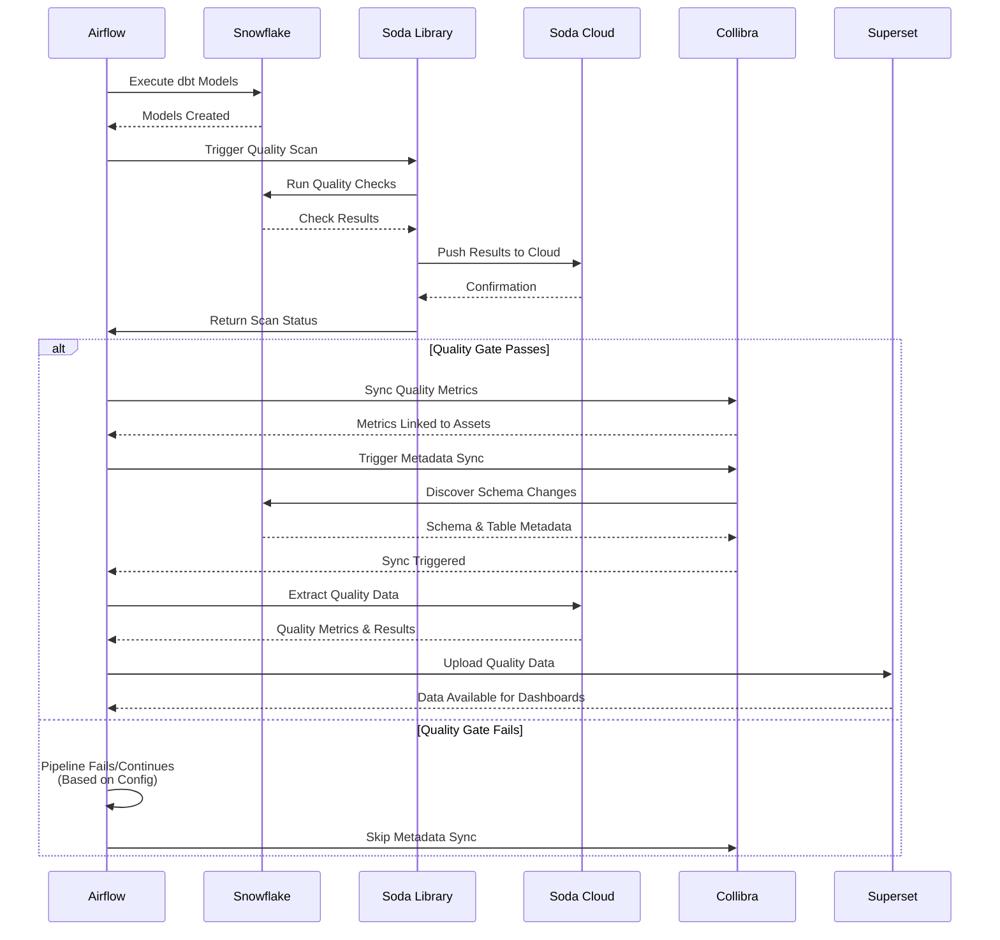

# Data Engineering, Governance, and Quality Integration Platform

A comprehensive platform demonstrating the integration of data engineering, data governance, and data quality management. This project showcases how to bridge the gap between technical data pipelines, governance frameworks, and quality monitoring to create a unified data management ecosystem.

## Project Overview

This platform demonstrates a complete integration framework that connects:

- **Data Engineering**: Automated data pipelines with transformations and orchestration
- **Data Governance**: Centralized catalog and metadata management with Collibra
- **Data Quality**: Automated quality monitoring with standardized dimensions and reporting

### Core Integration Value

**Unified Data Management**: Quality results are automatically synchronized with governance catalogs, creating a single source of truth where:
- Data quality metrics are linked to data assets (tables, columns)
- Governance metadata is enriched with quality insights
- Engineering pipelines trigger quality checks and governance updates
- All stakeholders access quality and governance information in one place

## Integration Architecture

### Three-Pillar Integration

```
Data Engineering (dbt + Airflow)
         ↓
    Data Pipeline
         ↓
Data Quality (Soda) ────→ Data Governance (Collibra)
         ↓                        ↓
    Quality Checks          Asset Mapping
         ↓                        ↓
    Quality Results ───────→ Governance Catalog
         ↓                        ↓
    Visualization (Superset) ────→ Unified View
```

### Complete Data Flow

```
RAW Layer (Snowflake)
    ↓
Soda Quality Checks (RAW) [VALIDATION PHASE]
    ↓
Collibra Metadata Sync (RAW Schema) [GOVERNANCE PHASE - GATED BY QUALITY]
    ↓
dbt Transformations (STAGING) [BUILD PHASE]
    ↓
Soda Quality Checks (STAGING) [VALIDATION PHASE]
    ↓
Collibra Metadata Sync (STAGING Schema) [GOVERNANCE PHASE - GATED BY QUALITY]
    ↓
dbt Models (MARTS) [BUILD PHASE]
    ↓
Soda Quality Checks (MARTS) [VALIDATION PHASE]
    ↓
Collibra Metadata Sync (MART Schema) [GOVERNANCE PHASE - GATED BY QUALITY]
    ↓
Soda Quality Checks (QUALITY) + dbt Tests [VALIDATION PHASE]
    ↓
Collibra Metadata Sync (QUALITY Schema) [GOVERNANCE PHASE - GATED BY QUALITY]
    ↓
Cleanup Artifacts [CLEANUP PHASE]
    ↓
Superset Upload [VISUALIZATION PHASE]
    ├──→ Updates data source names
    ├──→ Extracts data from Soda Cloud API
    ├──→ Organizes data (latest files only)
    └──→ Uploads to Superset PostgreSQL database
    ↓
Soda Cloud Dashboard + Superset Visualization + Collibra Integration
    ├──→ Quality Metrics → Data Assets (Tables)
    ├──→ Check Results → Column Assets
    ├──→ Quality Dimensions → Governance Framework
    └──→ Metadata Sync → Schema & Table Updates (Only Validated Data)
```

**Orchestration Philosophy: Quality Gates Metadata Sync**

Each layer follows: **Build → Validate → Govern**
- Quality checks **gate** metadata synchronization
- Collibra only syncs data that has passed quality validation
- This ensures Collibra reflects **commitments**, not **aspirations**
- Collibra becomes a historical record of accepted states

## Architecture Diagrams

### Integration Flow: Soda → Collibra → Superset



## Key Integrations

### Data Engineering Integration

**Pipeline Orchestration**
- Apache Airflow for workflow management
- Automated data transformations with dbt
- Multi-layer data pipeline (RAW → STAGING → MARTS)
- Integrated quality checks at each layer

**Transformation Framework**
- dbt Core for data modeling and transformations
- Layer-specific quality standards
- Automated schema management
- Data lineage tracking

### Data Governance Integration (Collibra)

**Metadata Synchronization (Quality-Gated)**
- Automatic metadata sync after each pipeline layer (RAW, STAGING, MART, QUALITY)
- **Quality checks gate metadata sync**: Only validated data enters Collibra
- Schema and table metadata automatically updated in Collibra catalog
- Real-time synchronization of schema changes and new tables
- Syncs triggered after quality validation, complete in Collibra background
- **Orchestration philosophy**: Build → Validate → Govern sequence ensures Collibra reflects commitments, not aspirations

**Quality-to-Governance Synchronization**
- Automatic mapping of quality checks to Collibra data assets
- Quality metrics linked to tables and columns in Collibra catalog
- Quality dimensions integrated into governance framework
- Real-time synchronization of quality results

**Asset Mapping**
- Tables mapped to Collibra Table assets
- Columns mapped to Collibra Column assets
- Quality checks created as Data Quality Metric assets
- Quality dimensions linked via governance relationships

**Configuration**
- Selective synchronization: Only datasets marked with `push_to_collibra_dic` attribute are synced
- Domain mapping: Quality results organized by governance domains
- Relationship management: Automatic creation of relationships between assets and quality metrics
- Ownership tracking: Quality metrics linked to asset owners
- Schema asset ID resolution: Automatically resolves schema asset IDs to schema connection IDs

**Quality Metrics in Collibra**
- Check evaluation status (pass/fail)
- Last run and sync timestamps
- Check definitions and configurations
- Diagnostic metrics (rows tested, passed, failed, passing fraction)
- Links to Soda Cloud for detailed analysis

**Metadata Sync Features**
- Automatic resolution of schema asset IDs to schema connection IDs
- Configurable per-layer synchronization (RAW, STAGING, MART, QUALITY)
- Syncs triggered and complete in Collibra background
- Error handling for conflicts and authentication issues

### Data Quality Integration (Soda)

**Standardized Quality Framework**
- Six data quality dimensions: Accuracy, Completeness, Consistency, Uniqueness, Validity, Timeliness
- 50+ automated quality checks across all layers
- Layer-specific quality standards (relaxed → stricter → strictest)
- Failed row sampling for detailed analysis

**Soda Cloud Integration**
- Centralized quality monitoring dashboard
- Dataset discovery and column profiling
- Sample data collection
- API integration for metadata extraction

**Quality Dimensions**
All quality checks are categorized using standardized dimensions:
- **Accuracy**: Data correctness, schema validation, range checks
- **Completeness**: Missing value detection
- **Consistency**: Referential integrity, cross-table validation
- **Uniqueness**: Duplicate detection
- **Validity**: Format and constraint validation
- **Timeliness**: Data freshness monitoring

## Technology Stack

- **Data Engineering**: Apache Airflow 2.8+, dbt Core 1.10.11
- **Data Warehouse**: Snowflake
- **Data Quality**: Soda Library 1.0.5 with Soda Cloud
- **Data Governance**: Collibra Data Intelligence Cloud
- **Visualization**: Apache Superset
- **Orchestration**: Docker & Docker Compose
- **Language**: Python 3.11

## Project Structure

```
├── soda/                             # Data quality configuration
│   ├── checks/                      # Quality checks by layer
│   │   ├── raw/                     # RAW layer checks
│   │   ├── staging/                 # STAGING layer checks
│   │   ├── mart/                    # MART layer checks
│   │   └── quality/                 # Quality monitoring
│   ├── configuration/               # Soda connection configs
│   └── soda-collibra-integration-configuration/
│       └── configuration-collibra.yml  # Collibra integration config
├── dbt/                              # Data transformations
│   ├── models/
│   │   ├── raw/                      # Raw data sources
│   │   ├── staging/                  # Staging transformations
│   │   └── mart/                     # Business-ready models
├── airflow/                          # Workflow orchestration
│   └── dags/                        # Pipeline DAGs
├── collibra/                         # Collibra integration
│   ├── metadata_sync.py            # Metadata synchronization module
│   ├── airflow_helper.py            # Airflow integration functions
│   ├── config.yml                   # Metadata sync configuration
│   └── README.md                    # Collibra integration documentation
├── superset/                         # Visualization
│   └── data/                        # Soda Cloud data exports
└── scripts/                          # Utility scripts
```

## Quick Start

### Prerequisites
- Docker & Docker Compose (latest version)
- Snowflake account with appropriate permissions
- Soda Cloud account (required for quality monitoring)
- Collibra Data Intelligence Cloud account (required for governance integration)
- Python 3.11+ (for local script execution)

### 1. Environment Setup

```bash
# Clone the repository
git clone <repository-url>
cd Soda-Certification

# Create .env file with your credentials (single file for entire project)
cp .env.example .env
# Edit .env with your actual credentials
```

**Important**: You only need **one `.env` file** in the project root. This file is used by:
- Docker Compose (Airflow, Superset)
- Local scripts
- All services in the project

The `.env` file is automatically loaded and mounted into Docker containers.

**Note**: The database name is parameterized via `SNOWFLAKE_DATABASE`. If not set, it defaults to `DATA_GOVERNANCE_PLATFORM`. All components (dbt, Soda, setup scripts) use this environment variable consistently.

**Automatic Data Source Name Updates**: Soda configuration files are automatically updated to match your `SNOWFLAKE_DATABASE` when you run:
- `make setup`, `make airflow-up`, `make all-up` - Before starting services
- `make airflow-trigger-init`, `make airflow-trigger-pipeline` - Before triggering DAGs
- `make superset-upload-data` - Before uploading data to Superset

This ensures data source names (e.g., `data_governance_platform_raw`) always match your database configuration. See [Soda Configuration](soda/README.md#data-source-name-parameterization) for details.

**Required Environment Variables:**
```bash
# Snowflake Configuration
SNOWFLAKE_ACCOUNT=your_account
SNOWFLAKE_USER=your_user
SNOWFLAKE_PASSWORD=your_password
SNOWFLAKE_WAREHOUSE=COMPUTE_WH
SNOWFLAKE_DATABASE=DATA_GOVERNANCE_PLATFORM  # Database name (default: DATA_GOVERNANCE_PLATFORM if not set)
SNOWFLAKE_SCHEMA=RAW

# Soda Cloud Configuration
SODA_CLOUD_HOST=https://cloud.soda.io
SODA_CLOUD_API_KEY_ID=your_api_key_id
SODA_CLOUD_API_KEY_SECRET=your_api_key_secret
SODA_CLOUD_ORGANIZATION_ID=your_org_id

# Collibra Configuration
COLLIBRA_BASE_URL=https://your-instance.collibra.com
COLLIBRA_USERNAME=your_username
COLLIBRA_PASSWORD=your_password
```

### 2. Start Services

```bash
# Start all services (Airflow + Superset)
make all-up

# Verify services are running
make airflow-status
make superset-status
```

### 3. Initialize and Run Pipeline

```bash
# Initialize data (creates tables and loads sample data)
make airflow-trigger-init

# Run complete pipeline (engineering + quality + governance sync)
make airflow-trigger-pipeline

# Extract and visualize Soda Cloud data
make superset-upload-data
```

### 4. Access Dashboards

- **Airflow UI**: http://localhost:8080 (admin/admin) - Monitor pipeline execution
- **Superset UI**: http://localhost:8089 (admin/admin) - View quality dashboards
- **Soda Cloud**: Your organization dashboard - Centralized quality monitoring
- **Collibra**: Your Collibra instance - Governance catalog with quality metrics

## Collibra Integration Configuration

### Setup

The Collibra integration consists of two parts:

1. **Quality Metrics Sync**: Configured in `soda/soda-collibra-integration-configuration/configuration-collibra.yml`
2. **Metadata Sync**: Configured in `collibra/config.yml`

### Quality Metrics Synchronization

**Configuration File**: `soda/soda-collibra-integration-configuration/configuration-collibra.yml`

**Key Configuration Options:**

**Dataset Selection**
- `filter_datasets_to_sync_to_collibra: true` - Only sync datasets marked for sync
- `soda_collibra_sync_dataset_attribute: "push_to_collibra_dic"` - Attribute to mark datasets
- `soda_no_collibra_dataset_skip_checks: true` - Skip checks if dataset not in Collibra

**Asset Mapping**
- Tables → Collibra Table assets
- Columns → Collibra Column assets
- Quality checks → Data Quality Metric assets
- Quality dimensions → Data Quality Dimension assets

**Relationships**
- Table/Column to Check relationships
- Check to Quality Dimension relationships
- Ownership and responsibility tracking

**Quality Metrics Synchronized**
- Check evaluation status (pass/fail)
- Last run and sync timestamps
- Check definitions
- Diagnostic metrics (rows tested, passed, failed, passing fraction)
- Links to Soda Cloud

**Marking Datasets for Collibra Sync**

To sync a dataset to Collibra, add the sync attribute in your Soda check file:

```yaml
discover datasets:
  datasets:
    - include TABLE_NAME
      attributes:
        push_to_collibra_dic: true
```

**Domain Mapping**

Quality results can be organized by Collibra domains:
- Configure domain mapping via `soda_collibra_domain_dataset_attribute_name`
- Set default domain via `soda_collibra_default_domain`
- Quality assets are created in appropriate governance domains

### Metadata Synchronization

**Configuration File**: `collibra/config.yml`

**Configuration Structure:**

```yaml
database_id: "your-database-asset-uuid"

# Optional: Database Connection ID (resolved automatically if not provided)
# database_connection_id: "your-database-connection-uuid"

raw:
  schema_connection_ids:  # These are schema asset IDs
    - "your-raw-schema-asset-uuid"

staging:
  schema_connection_ids:  # These are schema asset IDs
    - "your-staging-schema-asset-uuid"

mart:
  schema_connection_ids:  # These are schema asset IDs
    - "your-mart-schema-asset-uuid"
```

**How It Works:**
1. System automatically resolves schema asset IDs to schema connection IDs
2. **Quality checks gate metadata sync**: Metadata sync only happens after quality validation passes
3. After each layer's quality validation, metadata sync is triggered for that layer's schema
4. System waits for sync job to complete before proceeding to next layer
5. Schema and table metadata is updated in Collibra catalog
6. **Only validated data enters governance**: Collibra reflects commitments, not aspirations

**Orchestration Sequence (per layer):**
- **Build Phase**: dbt materializes models in Snowflake
- **Validation Phase**: Soda checks validate freshness, volume, schema, business rules
- **Decision Point**: If blocking checks fail → stop promotion; if non-blocking checks fail → annotate but continue
- **Governance Phase**: Collibra metadata sync (only what passed the layer's acceptance criteria)

**Finding Asset IDs:**
- **Database Asset ID**: Navigate to Database asset in Collibra, copy UUID from URL or asset details
- **Schema Asset IDs**: Navigate to each Schema asset (not Schema Connection) in Collibra, copy UUIDs

**For detailed metadata sync documentation, see**: [Collibra Integration README](collibra/README.md)

## Data Quality Dimensions

All Soda checks are standardized with six data quality dimensions:

| Dimension | Used For | Examples |
|-----------|----------|----------|
| **Accuracy** | Data correctness, schema validation, range checks | `schema`, `row_count`, `min()`, `max()`, `avg()` |
| **Completeness** | Missing value detection | `missing_count()` |
| **Consistency** | Referential integrity, cross-table validation | `invalid_count()` with referential checks |
| **Uniqueness** | Duplicate detection | `duplicate_count()` |
| **Validity** | Format and constraint validation | `invalid_count()` with regex/values |
| **Timeliness** | Data freshness monitoring | `freshness()` |

All checks include an `attributes` section with the appropriate `dimension` field for proper categorization in Soda Cloud, Collibra, and reporting tools.

## Pipeline Guardrail Configurations

The platform provides three pipeline configurations with different quality guardrail settings:

| Pipeline | RAW Layer | MART Layer | Use Case |
|----------|-----------|------------|----------|
| `soda_pipeline_run` (default) | **Lenient** - Continues on failures | **Lenient** - Continues on failures | Standard production pipeline |
| `soda_pipeline_run_strict_raw` | **Strict** - Fails on critical checks | **Lenient** - Continues on failures | Early source data validation |
| `soda_pipeline_run_strict_mart` | **Lenient** - Continues on failures | **Strict** - Fails on critical checks | Gold layer quality enforcement |

**Guardrail Behavior**:
- **Strict Mode**: Pipeline fails if critical checks fail; quality gate validates before Collibra sync
- **Lenient Mode**: Pipeline continues even if checks fail; no quality gate validation

**Triggering Pipelines**:
```bash
# Default pipeline (RAW lenient, MART lenient)
make airflow-trigger-pipeline

# Strict RAW guardrails
make airflow-trigger-pipeline-strict-raw

# Strict MART guardrails
make airflow-trigger-pipeline-strict-mart
```

## Quality Checks by Layer

### RAW Layer (4 tables)
- **CUSTOMERS**: 10,000+ customer records
- **PRODUCTS**: 1,000+ product catalog
- **ORDERS**: 20,000+ order transactions
- **ORDER_ITEMS**: 50,000+ order line items

**Quality Focus**: Initial assessment with relaxed thresholds to identify source data issues.

### STAGING Layer (4 tables)
- **STG_CUSTOMERS**: Cleaned customer data with quality flags
- **STG_PRODUCTS**: Standardized product information
- **STG_ORDERS**: Validated order transactions
- **STG_ORDER_ITEMS**: Processed order line items

**Quality Focus**: Validation after transformation with stricter requirements.

### MARTS Layer (2 tables)
- **DIM_CUSTOMERS**: Customer dimension with segmentation
- **FACT_ORDERS**: Order fact table with business metrics

**Quality Focus**: Business-ready data with strictest quality requirements.

## Available Commands

### Service Management
```bash
make all-up                  # Start all services
make airflow-up             # Start Airflow only
make superset-up            # Start Superset only
make airflow-down           # Stop Airflow
make superset-down          # Stop Superset
make airflow-status         # Check Airflow status
make superset-status        # Check Superset status
```

### Pipeline Execution
```bash
make airflow-trigger-init              # Initialize data
make airflow-trigger-pipeline          # Run complete pipeline (RAW lenient, MART strict)
make airflow-trigger-pipeline-strict-raw   # Run pipeline with strict RAW guardrails (pipeline fails if RAW checks fail)
make airflow-trigger-pipeline-strict-mart  # Run pipeline with strict MART guardrails (pipeline fails if MART checks fail)
```

**Pipeline Guardrail Configurations**:
- **`soda_pipeline_run`** (default): RAW layer lenient, MART layer lenient
- **`soda_pipeline_run_strict_raw`**: RAW layer strict (fails on critical checks), MART layer lenient
- **`soda_pipeline_run_strict_mart`**: RAW layer lenient, MART layer strict (fails on critical checks)

**Note**: The pipeline automatically uploads data to Superset after completion. Ensure Superset is running (`make superset-up`) before triggering the pipeline.

### Data Quality Management
```bash
make superset-upload-data   # Manual upload: Update data sources + extract + organize + upload to Superset
make soda-dump              # Extract from Soda Cloud
make organize-soda-data      # Organize data structure
make soda-update-datasources # Manually update Soda data source names (automatic in other commands)
```

### Development
```bash
make airflow-logs           # View Airflow logs
make superset-logs          # View Superset logs
make clean                  # Clean up artifacts
```

## Documentation

- **[Soda Configuration](soda/README.md)** - Detailed Soda setup, quality checks, and Collibra integration
- **[Airflow Setup](airflow/README.md)** - Workflow orchestration details
- **[Collibra Integration](collibra/README.md)** - Metadata synchronization and governance integration
- **[dbt Configuration](dbt/README.md)** - Data transformation setup
- **[Superset Setup](superset/README.md)** - Visualization configuration
- **[Scripts Documentation](scripts/README.md)** - Utility scripts guide

## Use Cases

This platform demonstrates:

1. **Integrated Data Management**: Seamless connection between engineering, governance, and quality
2. **Governance-Enabled Quality**: Quality metrics automatically linked to governance assets
3. **Quality-Informed Governance**: Governance decisions supported by real-time quality data
4. **Automated Synchronization**: Quality results automatically pushed to governance catalog
5. **Unified Visibility**: Single view of data assets, quality metrics, and governance metadata
6. **End-to-End Traceability**: Complete lineage from source to consumption with quality and governance context

## Integration Benefits

**For Data Engineers**
- Quality checks integrated into data pipelines
- Automated quality validation at each transformation stage
- Quality results inform pipeline improvements

**For Data Governance Teams**
- Quality metrics automatically available in governance catalog
- Quality dimensions integrated into governance framework
- Real-time visibility into data asset quality
- Automatic metadata synchronization after each pipeline layer
- Always up-to-date schema and table information in catalog

**For Data Consumers**
- Quality information accessible alongside data assets
- Trust indicators directly in governance catalog
- Quality trends and history for informed decision-making

**For Data Quality Teams**
- Standardized quality dimensions across all checks
- Automated synchronization with governance systems
- Centralized monitoring with distributed visibility

## Troubleshooting

### Common Issues

**Soda Cloud Connection**
- Verify API credentials in `.env`
- Check `SODA_CLOUD_HOST` is correct
- Ensure network connectivity

**Collibra Integration**
- Verify Collibra credentials in `.env`
- Check `COLLIBRA_BASE_URL` is correct
- Ensure datasets are marked with `push_to_collibra_dic` attribute
- Verify Collibra asset type IDs match your instance configuration

**Collibra Metadata Sync**
- Verify `collibra/config.yml` has correct database and schema asset IDs
- Ensure schemas have been synchronized at least once in Collibra (required for connection ID resolution)
- Check Collibra job status in Collibra UI if sync jobs fail
- Review Airflow task logs for detailed error messages
- Verify database connection ID can be resolved from database asset ID

**Snowflake Connection**
- Verify credentials in `.env`
- Check warehouse is running
- Ensure proper permissions

**Service Issues**
- Check container logs: `make airflow-logs` or `make superset-logs`
- Verify Docker is running
- Check service status: `make airflow-status`

## Success Metrics

- **Complete Integration**: Seamless connection between engineering, governance, and quality
- **Automated Synchronization**: Quality results automatically pushed to Collibra
- **Metadata Synchronization**: Schema and table metadata automatically synced after each layer
- **Standardized Framework**: Six quality dimensions across all checks
- **Multi-Layer Monitoring**: Quality checks at RAW, STAGING, MART, and QUALITY layers
- **Governance Integration**: Quality metrics linked to data assets in Collibra
- **Unified Visibility**: Single view across all data management domains
- **Production Ready**: Enterprise-grade integration platform

---

**Project Status**: Production Ready  
**Last Updated**: January 2025  
**Version**: 2.0.0
